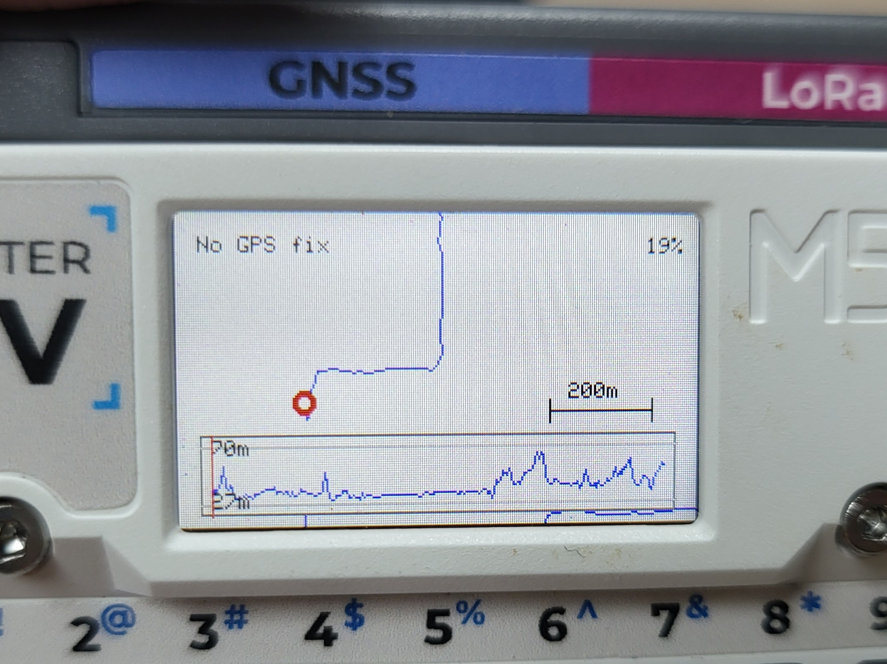
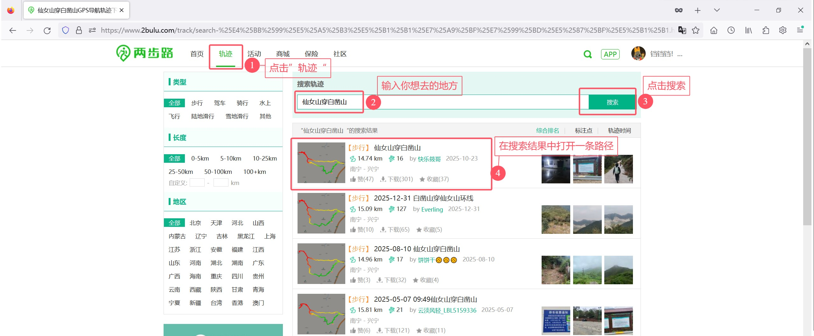
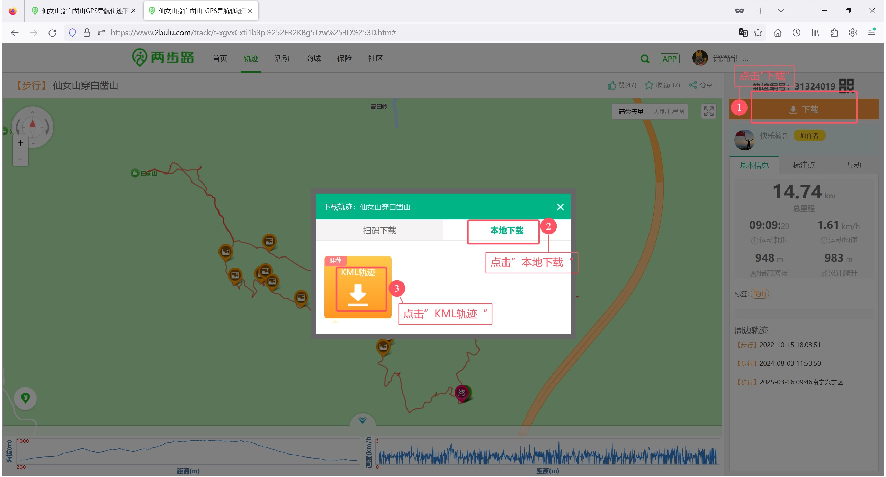

# HikePod

## 项目简介

HikePod是一个基于M5Stack Cardputer ADV的户外徒步导航项目，集成了GPS定位、轨迹记录、离线地图加载等功能，为户外爱好者提供便捷的导航工具。

## 技术要点

- **硬件需求**：M5Stack Cardputer ADV + CAP-LoRa-1262 + SD卡
- **GPS模块**：测试了CAP-1262模块，可通过设置修改Rx/Tx引脚适配其他GNSS模块（未测试）
- **显示技术**：采用离屏渲染技术，尽量渲染丝滑的动画效果
- **离线导航**：加载KML格式的路径文件
- **电量优化**：针对户外使用场景进行了省电优化，在大多数时间息屏定位的使用场景下，电池可持续使用8小时
- **轨迹记录**：实时记录徒步轨迹并在地图上显示

## 操作使用方法

### 刷入固件说明
- **刷入固件**：通过M5Bunner将固件文件刷入M5Stack Cardputer ADV
- **使用说明**：请参考项目文档中的使用说明

### 基本操作

- **[h]**：打开帮助菜单
- **[c]**：打开设置菜单
- **[Space]**：锁定/解锁当前位置
- **[t]**：开始/停止轨迹记录模式
- **[TAB]**：切换到GPS Info模式
- **[ESC]**：切换调试信息显示
- **[+]**：放大地图
- **[-]**：缩小地图
- **[方向键]**：平移地图

### 从两步路网站下载离线KML文件

1. 打开两步路网站（www.2bulu.com）
2. 登录您的账号
3. 在网站上找到您需要的离线地图或轨迹
4. 点击下载按钮，选择KML格式
5. **重要**：确保文件名使用英文或拼音，不要包含中文字符
6. 将下载的KML文件保存到储存卡的HikePod目录下

### 通过程序加载KML文件

1. 启动HikePod程序
2. 按下[c]键进入设置菜单
3. 选择"select KML file"选项
4. 浏览并选择SD卡中HikePod目录下的".kml"文件
5. 等待程序加载完成
6. 加载完成后，地图和海拔信息将会显示在屏幕上

## 功能说明

### 主要功能

- **实时定位**：显示当前GPS位置、海拔、GPS卫星信息等
- **轨迹记录**：记录徒步轨迹至kml文件中
- **离线路径显示**：支持在地图上显示加载的离线kml文件路径
- **海拔显示**：显示当前位置的海拔信息
- **GPS卫星信息显示**：显示当前GPS卫星数量、信号强度、海拔信息

### 注意事项

- 目前只支持英文或拼音的文件名的KML文件
- 为了省电，GPS更新频率已降低，航向判断可能不够准确，可通过大幅快速移动来判断方向
- 加载离线地图背景可能会受到内存限制，建议使用经过优化的KML文件（目前测试了4000+个路径点的kml文件，内存占用在500KB左右）
- 本应用的使用场景是在户外徒步时大多数时间代替手机定位以节省手机电量，使得手机可以保持与外界沟通，本应用不应替代专业定位设备
- 请不要在2866营地使用cardputer避免被神秘园网友捡到（笑.jpg）

## 截图展示

### 待解决问题
- 按空格键自动平移到当前位置/路径起点的功能有时候无效（已增加锁定功能）
- 电量消耗曲线不够平滑且会超出菜单范围

### 后续还考虑实现
1. **航向显示**
   - 为了省电降低了gps更新频率，航向判断不可靠，暂时不考虑这个功能。用户可通过大幅快速移动来判断方向
2. **省电优化**
   - 需要进一步观察效果。在设置菜单下增加电量消耗情况曲线
   - 徒步一天7小时，还剩30%电量，可以接受了。还有优化点后续再做
3. **加载离线地图背景**
   - 可能内存不够，目前加载500KB的kml文件已经是经过优化了
   - 先解决缩放容易丢失焦点的问题即可，离线地图背景难搞
4. **联网下载KML**
   - 从两步路app发送是不是更方便？
5. **支持其他GNSS模块和cardputer1.1**
   - 目前在GPS info模式的设置中修改Rx/Tx引脚应该可以实现了，待购买模块测试（省电优化中可能需要适配）
   - 还没试过同时编译支持v1.1和ADV，可能键盘支持是个大问题

## 致谢

GPS Info模式是由[Cardputer GPS Info](https://github.com/alcor55/Cardputer-GPS-Info)项目移植而来的，在此特别感谢原作者alcor55。
特别感谢 [alcor55](https://github.com/alcor55) 开发的Cardputer GPS Info项目，为HikePod提供了GPS信息显示功能的基础。

## 许可证

MIT License

---
